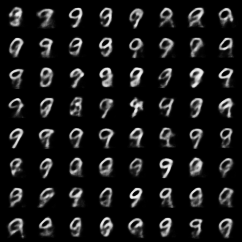
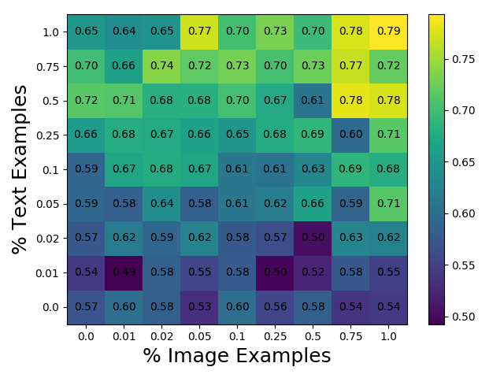

# MMVAE

A generative model learns the joint distribution between images and texts in a VAE-style fashion. Focus on bootstrap learning where we only have sparse example of (image, text) relationships.

## MNIST Experiment

Train MMVAE on MNIST with using images as the first modality and labels as text for the second modality. We try to learn a joint representation across modalities.

#### Manifold

#### Joint Image Samples 

#### Image Samples Conditioned on Label 9
Fix the second modality to be 9 and generate image samples from the conditional distribution.

#### Weak Supervision
Only show a fixed percentage of paired (image, label) data, and see how MMVAE does on predicting MNIST labels (generating text). 

## MultiMNIST Experiment

Train MMVAE on MultiMNIST sans translation/dilation; 0 to 4 digits are projected into a 50 x 50 image. For example, a possible text example would be "12" or "" or "4732".

#### Joint Image Samples

#### Image Samples Conditioned on Label 1773

#### Weak Supervision

Only show a fixed percentage of paired (image, label) data, and see how MMVAE does on predicting MNIST labels (generating text). 

During training, we provide independent image and text examples that are not paired. We can vary the amount of each modality we show MMVAE and see how weak supervision in modalities (rather than in the labeled pairs) affect performance.

Character Prediction Accuracy: 

Length Prediction Accuracy: 

