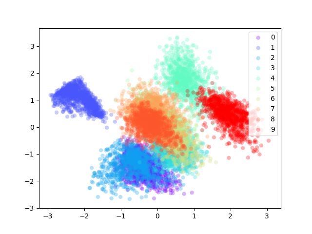
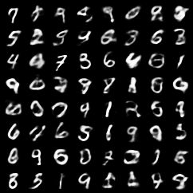
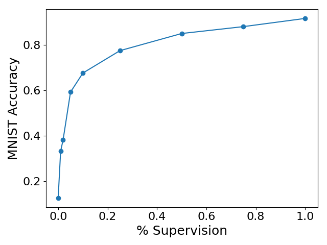

# MMVAE

A generative model learns the joint distribution between images and texts in a VAE-style fashion. Focus on bootstrap learning where we only have sparse example of (image, text) relationships.

## MNIST Experiment

Train MMVAE on MNIST with using images as the first modality and labels as text for the second modality. We try to learn a joint representation across modalities.

#### Manifold

#### Joint Image Samples 

#### Image Samples Conditioned on Label 9
Fix the second modality to be 9 and generate image samples from the conditional distribution.

#### Weak Supervision
Only show a fixed percentage of paired (image, label) data, and see how MMVAE does on predicting MNIST labels (generating text). 

